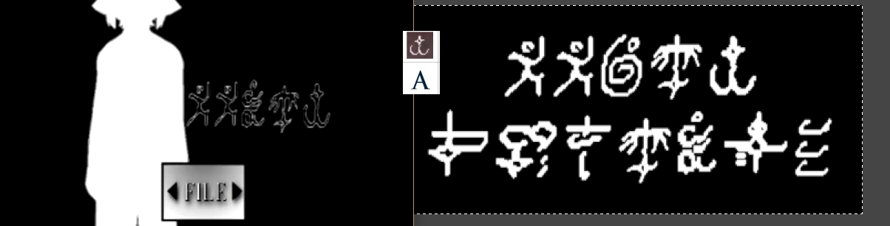

# Fake Yabujin content

## 𝔇𝔍 6YRథ్‌٣٣A ЗАО - 15 𝓫𝓪𝓷𝓲𝓮𝓴

Not a Yabujin song - this was briefly uploaded during the [March 2022 hack](2022-hack.md), and is actually a reupload of [INSERT NAME HERE].

## XIUSSOFT xcl.

This video was posted in the #yab-general channel on the nkweb server by an anonymous account, which quickly removed it and left the server not long after. It was presumed by some to be made by Yabujin; however, it was actually made by <b>taconiel</b>, who expressed remorse for making and publishing the video.

Here's a comparison between the font on the title screen and the fanmade Azeroy font - notice how the left side of the letter A is thicker than the original (pasted in the middle for reference).

The voice lines remixed in the title screen BGM were taken from Hydra (10:55 timestamp).

The title screen image is taken from the game <i>Changed</i>:

